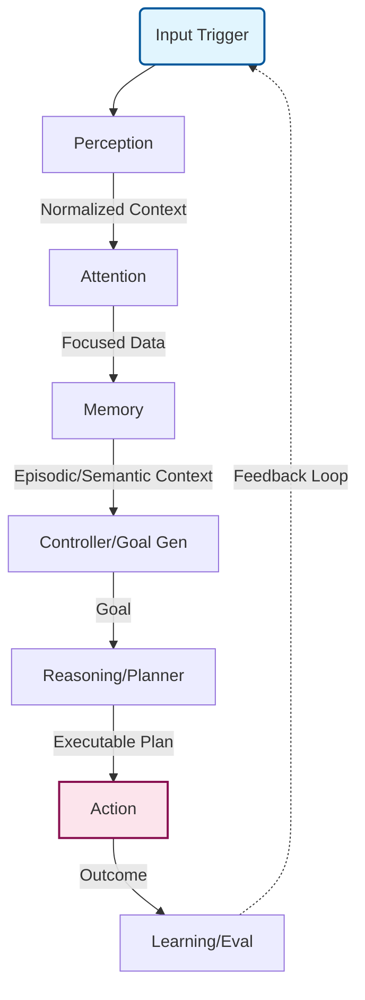

# Architecture Instructions

Welcome to **Cerebellum**, a distributed, asynchronous, event-driven cognitive architecture heavily inspired by neuroscience.

The system is designed with extreme decoupling. **Direct module-to-module communication is strictly forbidden.** All interactions flow through a central nervous system represented by the **Event Bus**.

## High-Level Cognitive Flow

The system simulates cognitive steps in a continuous loop:

## Immutable Architectural Rules

### 1. The Event Bus is the Only Bridge
* **Never** instantiate or inject a cognitive module directly into another cognitive module (e.g., `Reasoning` should not hold an instance of `Perception`).
* Components should emit structured payloads (via `pydantic` models) representing events: `Event(topic="perception.done", data=PerceptionResult)`
* A global controller or router (e.g., `CognitiveSystem`) is the ONLY entity allowed to orchestrate the pipeline by passing outputs of one subsystem to another, if an `EventBus` isn't fully active.

### 2. Neuro-inspired Subsystems
Any new feature must be categorized appropriately:
* **Perception:** Normalizing raw inputs (text, image, sensory data) into structured internal representations.
* **Attention:** Filtering out noisy context; deciding what payload is relevant right now.
* **Memory:** Interacting with Qdrant vector DBs (Episodic) or standard dictionaries (Working/Semantic). **Does not execute tasks.**
* **Reasoning/Planning:** Constructing multi-step `Plan` objects (using LLMs like `axonium` via `llm_reasoner`).
* **Action:** Executing side-effects in the real world (calling external APIs, controlling a machine).

### 3. Separation of Concerns (Cognition vs. Infrastructure)
* **Cognition modules** (brain logic) must NEVER directly write to HTTP clients or Vector DB clients.
* **Infrastructure modules** implement the interfaces needed by Cognition. `db_episodic` implements memory storage using `AsyncQdrantClient`, but `EpisodicMemory` doesn't know about `qdrant`.

### 4. Statelessness where possible
Keep cognitive workers stateless. Maintain conversation history or task graphs exclusively inside `WorkingMemory` or `EpisodicMemory`.