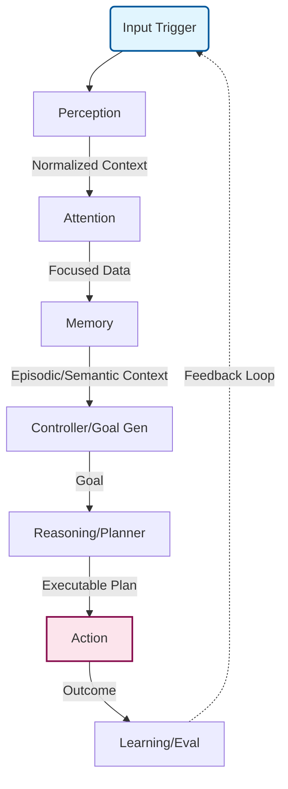

# Architecture Instructions

Welcome to **Cerebellum** — a distributed, asynchronous, event-driven cognitive architecture framework for building AI agents with full perception → memory → planning → reasoning → action loops, heavily inspired by human neuroscience.

The system is designed with extreme decoupling. **Direct module-to-module communication is strictly forbidden.** All interactions flow through a central nervous system represented by the **Event Bus** (`src/cerebellum/cognition/runtime/event_bus.py`).

## High-Level Cognitive Flow

The system simulates cognitive steps in a continuous loop:

## Immutable Architectural Rules

### 1. The Event Bus is the Only Bridge
* **Never** instantiate or inject a cognitive module directly into another cognitive module (e.g., `Reasoning` should not hold an instance of `Perception`).
* Components emit structured payloads via `pydantic` models defined in `src/cerebellum/cognition/runtime/protocols.py`.
* The `CognitiveRuntime` (`src/cerebellum/cognition/runtime/cognitive_runtime.py`) is the ONLY orchestrator. Each module inherits from `CognitiveModule` and registers itself in the runtime.
* Topic naming conventions (all lowercase, dot-separated):
  - `perception.[process|output]`
  - `attention.[focused|set_focus]`
  - `memory.[store|recall|search]` / `memory.[available|stored]`
  - `reasoning.plan_ready`
  - `action.[completed]`

### 2. Neuro-inspired Subsystems
Any new feature must be categorized appropriately:
* **Perception:** Normalizing raw inputs (text, image, sensory data) into structured internal representations.
* **Attention:** Filtering out noisy context; deciding what payload is relevant right now.
* **Memory:** Interacting with Qdrant vector DBs (Episodic) or standard dictionaries (Working/Semantic). **Does not execute tasks.**
* **Reasoning/Planning:** Constructing multi-step `Plan` objects (using LLMs like `axonium` via `llm_reasoner`).
* **Action:** Executing side-effects in the real world (calling external APIs, controlling a machine).

### 3. Separation of Concerns (Cognition vs. Infrastructure)
* **Cognition modules** (`src/cerebellum/cognition/`) contain pure brain logic and must NEVER directly import or instantiate HTTP clients, vector DB clients, or LLM SDKs.
* **Infrastructure modules** (`src/cerebellum/infraestructure/`) implement the concrete adapters:
  - `infraestructure/llm/` — wraps `axonium` SDK; exposes `complete()` and `chat()` via `llm_client.py`
  - `infraestructure/storage/` — implements Qdrant (`AsyncQdrantClient`) adapters for episodic and semantic memory
  - `infraestructure/observability/` — `tracer.py` and `metrics.py`
* `EpisodicMemory` (`cognition/memory/episodic_memory.py`) must not know about `qdrant-client` directly; storage logic lives in `infraestructure/storage/db_episodic.py`.

### 4. Statelessness where possible
Keep cognitive workers stateless. Maintain conversation history or task graphs exclusively inside `WorkingMemory` or `EpisodicMemory`.