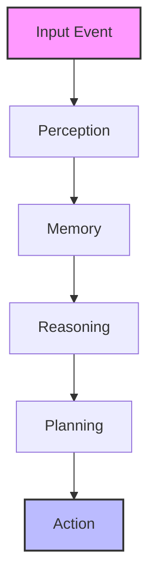

# Architecture Instructions

The **Cerebellum** system follows an **event-driven cognitive architecture**.

All component interactions must use the **Event Bus**; **direct module-to-module calls are strictly forbidden.**

## Flow of Cognition

## Module Rules
1. **Subscribe:** Modules must subscribe to incoming events relevant to their domain.
2. **Process:** Operate asynchronously (using `await`).
3. **Publish:** Modules must publish their results back to the Event Bus for the next stage in the pipeline.
4. **Isolation:** No direct imports between sibling cognitive subsystems (e.g. `Perception` should not import from `Reasoning`).